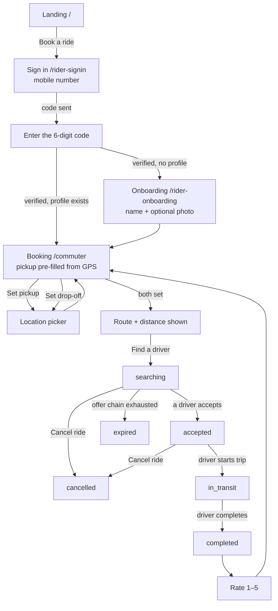
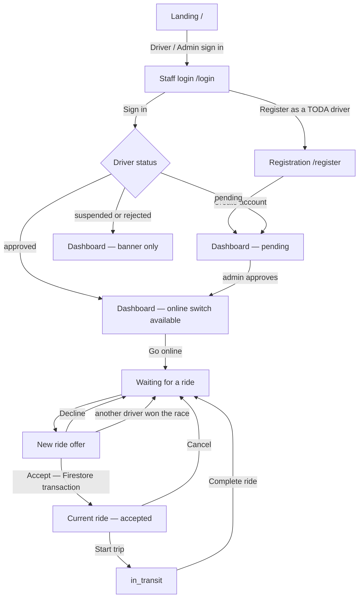
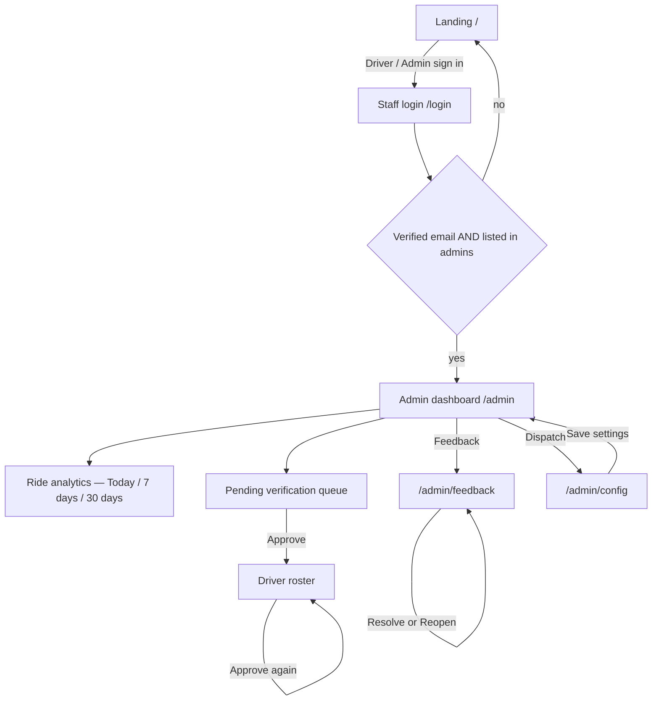
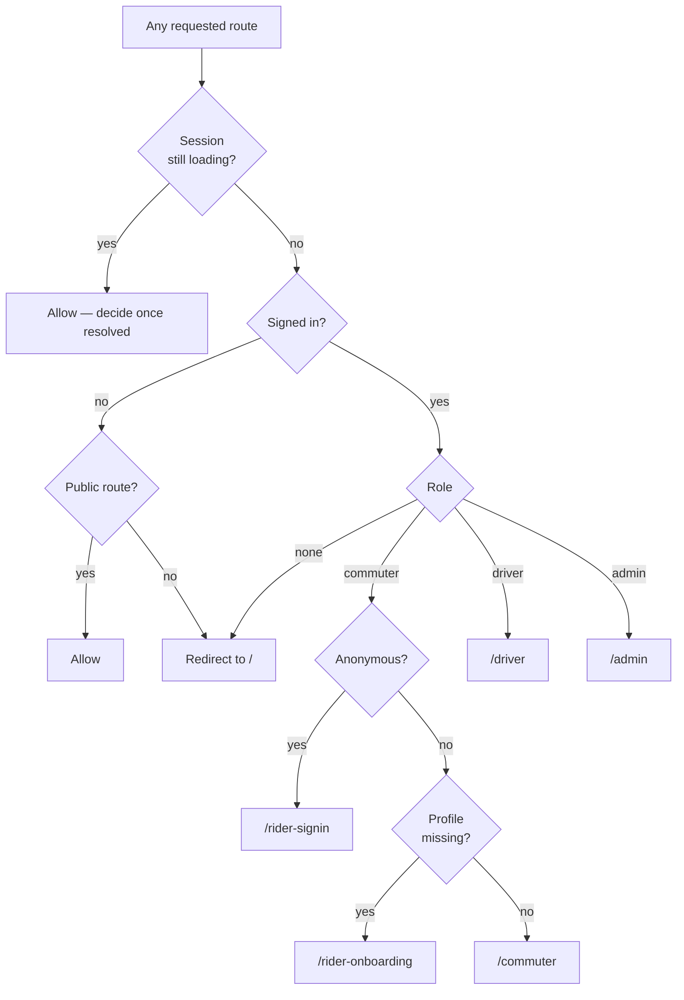

# TrikeKoTo — Screen Flows & State Inventory

Traced from the implemented app: [`app_router.dart`](../lib/core/router/app_router.dart)
and each screen's build method. This documents the system as built — it is not a
record of designs drawn beforehand.

Use it two ways: paste the Mermaid blocks into your thesis document, and work the
state tables as a checklist so no state is discovered missing mid-defence.

> **Last traced: 9 September 2026**, against the deployed build.
>
> Re-trace this whenever a route or a screen state changes. The first version of
> this file was written before commuter accounts existed and described anonymous
> entry that had already been removed — a document that describes an app nobody
> can run is worse than no document, because it is read as though it were true.

---

## Part A — Role flows

### A1. Commuter

Four things on this diagram are worth defending out loud.

**There is no anonymous path.** Every commuter verifies a mobile number before
they can book. The gate that matters is not this screen but `hasVerifiedPhone()`
on ride creation in the security rules — a client screen can be bypassed, a
token claim cannot.

**Onboarding is one field.** The number is already proven by the OTP, so the
only thing left the service genuinely needs is what to call this person when a
driver arrives. Every extra field here is a reason to abandon an account.

**The commuter cannot cancel once `in_transit`** — they are physically in the
vehicle.

**`expired` is a distinct outcome from `cancelled`**, because nobody chose it.
It means dispatch ran out of drivers.

### A2. Driver

The branch labelled *another driver won the race* is the one to point at: two
drivers can tap Accept at the same instant, and the loser is returned to waiting
rather than shown a broken ride.

### A3. Administrator

Admin access needs **both** a verified email address and a document in `admins`.
Email/password signup does not prove you own the address you typed, so the
verified flag is what stops someone registering an account that matches an admin
record and being let in.

### A4. The role redirect

Not a screen — the single decision point that puts every signed-in user in their
own shell. Worth its own figure, because it is where the three interfaces in one
APK actually separate.

The four public routes are `/`, `/login`, `/register` and `/rider-signin`. That
last one has to be public because a commuter reaches it *before* they have an
account, and often before they are signed in at all.

The two commuter branches are ordered, and the order matters. **Anonymous is
checked first**, because a session left over from before accounts were required
has no phone number and no profile — testing for the missing profile first would
send it to onboarding, where the write would be refused by the rules with
nothing on screen to explain why.

**Loading returns early and allows the route.** Redirecting during resolution
would fling every visitor to the landing screen for a frame on each cold start.

`/admin/feedback` and `/admin/config` are nested routes, so the
`startsWith('/admin')` test covers them automatically. An admin-only area stays
admin-only by construction rather than by remembering to guard each new path.

**The email-verification gate is not in this diagram**, because it is not in the
router. An admin whose address is unconfirmed is routed to `/admin` normally and
the dashboard renders `VerifyEmailScreen` in place of its content. It is a state
of screen 7, not a route of its own — see the note there.

---

## Part B — Screen state inventory

**★** = draw this plate. Everything else is a note under the plate it varies from.

### 1. Landing — `/`

| State | Trigger | On screen |
|---|---|---|
| ★ Default | Open app, signed out | Title, tagline, **Book a ride**, **Driver / Admin sign in**, footer note |

One state only. **Book a ride** used to trigger an anonymous sign-in, which gave
this screen a busy state and an error state; it is now a plain navigation to
`/rider-signin`, so neither can occur.

### 1a. Rider sign-in — `/rider-signin`

Two panes in one route, not two routes. The code arrives seconds after the
number is submitted, and a route change loses the keyboard and the number they
just typed if anything goes wrong.

| State | Trigger | On screen |
|---|---|---|
| ★ Number pane | From landing | "Ano ang number mo?", mobile field with `09XX XXX XXXX` hint, **Send code** |
| ★ Field error | Invalid number submitted | "Enter an 11-digit mobile number starting 09" under the field |
| Sending | Valid submit | Spinner in the button, label reads "Sending…" |
| ★ Code pane | Code sent | "Ilagay ang code", six-digit centred field, **Kumpirmahin**, **Ibang number** |
| Confirming | Code submitted | Spinner in the confirm button |
| ★ Error | Any auth failure | Snackbar in plain wording; unknown codes keep `[firebase_auth/code]` visible |

The error copy is worth a sentence in the annotation. Firebase's codes describe
the problem to a developer; these describe it to a commuter standing at a
terminal — *"That code expired. Ask for a new one."* An **unrecognised** code is
shown verbatim in brackets rather than flattened to "error", because a bare
"error" tells the person nothing and tells whoever they report it to less.

Auto-verification is a real state with no plate: Play Integrity can confirm the
device without an SMS, and the session is signed in with no code ever entered.

### 1b. Rider onboarding — `/rider-onboarding`

| State | Trigger | On screen |
|---|---|---|
| ★ Default | First sign-in, no profile | Avatar picker with camera badge, "Litrato — puwedeng laktawan", "Anong itatawag namin sa iyo?", name field, verified number line, **Simulan** |
| Photo chosen | Picked from camera or gallery | Avatar shows the image, badge switches to a pencil |
| ★ Field error | Empty or over-long name | "Ilagay ang pangalan mo" / "Masyadong mahaba" |
| Busy | Tapped Simulan | Spinner in the button, picker disabled |
| Error | Write or upload failed | Snackbar; stays on screen |

The number is displayed with a tick and **is not editable** — changing it means
proving a new one, which means signing in again, so presenting it as a field
would be a promise the rules refuse to keep.

The photo is not uploaded when picked. The bytes are held until **Simulan**, so
the profile document and the photo are written together and backing out leaves
no orphaned object in a bucket you pay for.

### 2. Staff login — `/login`

| State | Trigger | On screen |
|---|---|---|
| ★ Default | From landing | "Welcome back", email, password, **Sign in**, **Register as a TODA driver**, back arrow |
| ★ Field errors | Submit with bad input | Per-field messages under the offending field |
| Busy | Valid submit | Spinner inside Sign in, form disabled |
| Error | Wrong credentials | Snackbar |

### 3. Driver registration — `/register`

| State | Trigger | On screen |
|---|---|---|
| ★ Default | From login | Name, mobile, plate, TODA chapter, email, password, **Create account** |
| ★ Field errors | Submit incomplete | Messages name the field rather than saying "Required" |
| Busy | Valid submit | Spinner in button |
| Success | Account created | Redirect to `/driver`, pending banner showing |

### 4. Commuter booking — `/commuter`

The most state-heavy screen in the app. Eleven distinct renderings.

| State | Trigger | On screen |
|---|---|---|
| ★ Locating | Land on screen | Pickup row reads "Hinahanap ang lokasyon mo…", drop-off empty |
| ★ Pickup pre-filled | GPS fix reverse-geocoded | Pickup shows an address, drop-off still empty |
| Location refused | Permission denied or GPS off | Pickup falls back to "Set on map" — the pre-GPS behaviour |
| Pickup only | Returned from picker | Pickup filled by hand, drop-off still empty, no route yet |
| ★ Routing | Both set | "Working out the route…" |
| ★ Routed | Route returned | Distance and time, name and mobile fields, **Find a driver** |
| Booking | Tapped Find a driver | Button reads "Finding a driver…", spinner |
| ★ `searching` | Ride created | "Looking for a driver…", **Cancel ride** |
| ★ `accepted` | Driver accepted | "Driver is on the way", driver name/plate/rating, call button, map, **Cancel ride** |
| ★ `in_transit` | Driver started | "On the way to your drop-off", live map — **no cancel button** |
| ★ `completed` | Driver completed | Rating card: "How was your ride?", 1–5 stars |
| ★ Error | Listener failed | Cloud-off icon, plain message, **Try again** |

The pickup fills itself in because most trike rides start where the passenger
already is, so an empty field asks them to state something the phone knows. Two
properties are worth defending: a **late-arriving fix never overwrites a point
the commuter set by hand** while it was in flight, and **every step fails safe**
— a denied permission, disabled location services, or an unreachable geocoder
each leave the original tap-to-set behaviour intact. A convenience that blocks
booking is a defect.

### 5. Location picker — pushed from booking

| State | Trigger | On screen |
|---|---|---|
| ★ Default | Opened | Map, fixed centre crosshair, search field on top, label field, confirm |
| Searching | Query ≥ 3 chars, submitted | Spinner in search field |
| ★ Results | Search returned | Result list overlaying the map |
| No results | Nothing within the search bounds | Snackbar naming the bound, not claiming the place does not exist; map unchanged |
| Locating | Tapped my-location | Spinner |
| Permission denied | GPS refused | Snackbar; picker still usable by panning |

The crosshair is fixed and the **map moves under it**, so a thumb never covers
the point being chosen. That is a real design decision — say so in the annotation.

Search is **bounded to roughly 55 km around the current map centre**
(`bounded=1`, a 0.5° viewbox, `countrycodes=ph`). That is correct for the
domain — a tricycle does not make a hundred-kilometre trip, and an unbounded
search returns a "Plaza" three provinces away — but it means the empty result
must not claim the place does not exist. The bound follows the map, so the
recovery is real: pan toward the destination, then search again.

Search also runs **on submit, never per keystroke**. Nominatim's usage policy
forbids client-side autocomplete on the public instance. Self-hosting (already
on the roadmap) is what would unlock live suggestions.

### 6. Driver dashboard — `/driver`

| State | Trigger | On screen |
|---|---|---|
| No profile | Auth exists, no driver doc | "No driver profile found." |
| ★ `pending` | Registered, unverified | Hourglass banner, **no online switch, no offers** |
| ★ `suspended` | Admin suspended | Block icon, "You cannot accept rides" |
| `rejected` | Admin rejected | Cancel icon, "Your registration was rejected." |
| ★ Approved, offline | Verified, switch off | Verified banner, "You are offline" empty state |
| ★ Approved, online, idle | Switch on, no offers | "Waiting for a ride" |
| ★ Offer received | Dispatch pinged this driver | "New ride offer", pickup → drop-off, **Decline** / **Accept** |
| ★ Ride `accepted` | Accepted the offer | "Current ride", map to pickup, **Start trip**, Cancel |
| ★ Ride `in_transit` | Tapped Start trip | Map to drop-off, **Complete ride**, Cancel |

Every non-approved state hides the online switch *and* the offer list. A suspended
driver is not shown offers they cannot take.

### 7. Admin dashboard — `/admin`

| State | Trigger | On screen |
|---|---|---|
| ★ Unverified admin | `admins` doc exists, address unconfirmed | `VerifyEmailScreen` replaces the whole dashboard: **Send verification email**, then **I have verified** |
| Loading | Opened | Progress bar in the analytics card |
| ★ No rides in window | Empty window | "No rides in this window." — not a row of zeroes |
| ★ Populated | Rides exist | Window selector, five headline figures, daily chart, driver table |
| Truncated | Over 2,000 rides | Notice: totals below are partial |
| ★ Empty queue | Nobody pending | "Nothing waiting for review" |
| ★ Queue populated | Drivers pending | Cards with **Approve** |
| No drivers at all | Fresh install | "No drivers yet" |
| Feedback badge | Unresolved reports | Count on the Feedback tile; absent at zero |

The unverified-admin state is the one to explain out loud. The client resolves
the admin role from the `admins/{email}` document alone, but the **security
rules additionally require a confirmed address** — so without this screen the
panel would load and every read beneath it would fail with a permission error
explaining nothing. It also solves a bootstrap problem: the Firebase console can
neither send a verification email nor mark an address verified, so confirming
the *first* admin would otherwise need a service-account key.

Money was removed from this panel along with the fare engine. The app quotes no
prices and stores none — if a plate drawn from an older version shows a fares
box, it is wrong.

### 8. Feedback inbox — `/admin/feedback`

| State | Trigger | On screen |
|---|---|---|
| ★ Nothing at all | No reports ever | Empty state |
| ★ Open + resolved | Mixed | "Needs attention (n)" then "Resolved (n)" |
| Open empty only | All handled | Empty state under the heading, resolved list still below |
| Report card | — | Message, role, contact if given, **Resolve** or **Reopen** |

### 9. Dispatch — `/admin/config`

| State | Trigger | On screen |
|---|---|---|
| Loading | Opened | Blank until config arrives |
| ★ Form | Loaded | One section: **Matching**, plus the stop switch |
| ★ Validation error | Out-of-range value | "Must be between x and y" under the field |
| Busy | Saving | Spinner in **Save settings** |
| Saved | Write succeeded | Snackbar: "Settings saved. Clients update live." |

---

## What to actually draw

**65 states across 11 screens.** Drawing all of them is not a good use of your time.

Draw the **38 marked ★**. They are the ones where the layout genuinely differs.
The rest are the same layout with a button disabled or a spinner swapped in —
cover those in the annotation beneath the plate they vary from.

Draw them in this order, because it front-loads the screens your panel will ask
about:

| | Screen | Plates |
|---|---|---|
| 1 | Commuter booking | 9 |
| 2 | Driver dashboard | 7 |
| 3 | Rider sign-in + onboarding | 6 |
| 4 | Admin dashboard | 5 |
| 5 | Login + registration | 4 |
| 6 | Location picker | 2 |
| 7 | Feedback inbox | 2 |
| 8 | Dispatch | 2 |
| 9 | Landing | 1 |

Booking now leads rather than the driver dashboard. It gained the pickup states
and it is the screen the ride lifecycle runs through, so it is where the
questions land. The driver dashboard follows because it carries the verification
logic and is still the most conditional layout in the app. Those two are 16 of
the 38. The account flow sits third because it is the newest thing here and the
part a panel will not have seen in any earlier version of this project.

The drawn set lives in the design canvas — see the note at the top of this file
for the link. Re-trace this document *before* redrawing anything: the plates are
generated from these tables, so a stale table produces a confidently wrong
figure set.
