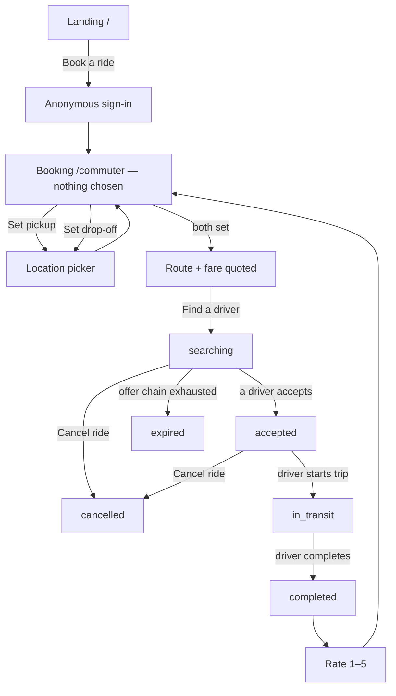
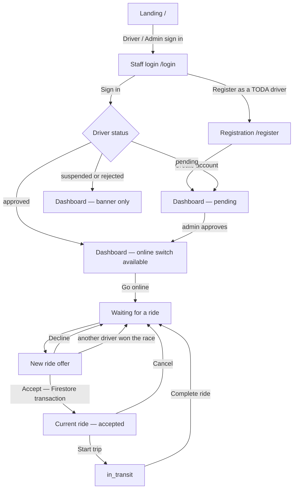
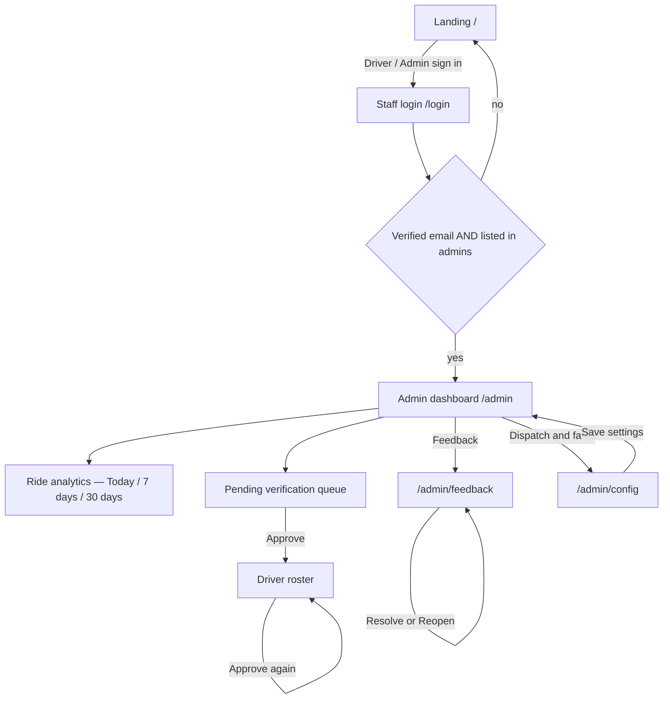
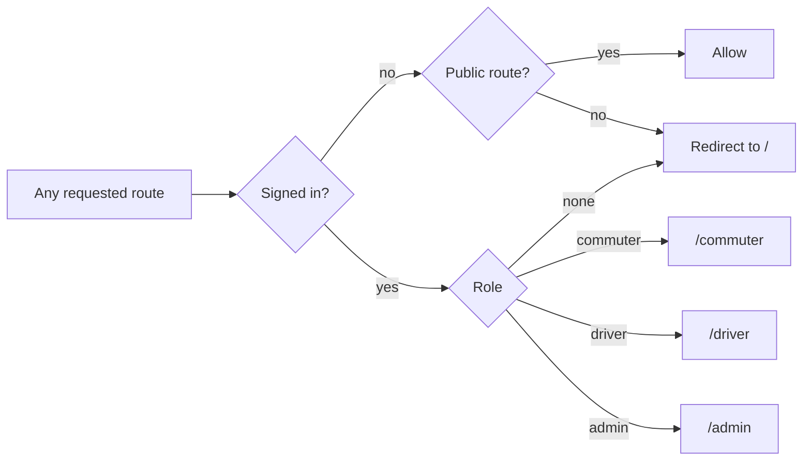

# TrikeKoTo — Screen Flows & State Inventory

Traced from the implemented app: [`app_router.dart`](../lib/core/router/app_router.dart)
and each screen's build method. This documents the system as built — it is not a
record of designs drawn beforehand.

Use it two ways: paste the Mermaid blocks into your thesis document, and work the
state tables as a checklist so no state is discovered missing mid-defence.

---

## Part A — Role flows

### A1. Commuter

Two things on this diagram are worth defending out loud: the commuter **cannot
cancel once `in_transit`** — they are physically in the vehicle — and **`expired`
is a distinct outcome from `cancelled`**, because nobody chose it. It means
dispatch ran out of drivers.

### A2. Driver

The branch labelled *another driver won the race* is the one to point at: two
drivers can tap Accept at the same instant, and the loser is returned to waiting
rather than shown a broken ride.

### A3. Administrator

Admin access needs **both** a verified email address and a document in `admins`.
Email/password signup does not prove you own the address you typed, so the
verified flag is what stops someone registering an account that matches an admin
record and being let in.

### A4. The role redirect

Not a screen — the single decision point that puts every signed-in user in their
own shell. Worth its own figure, because it is where the three interfaces in one
APK actually separate.

`/admin/feedback` and `/admin/config` are nested routes, so the `startsWith('/admin')`
test covers them automatically. An admin-only area stays admin-only by construction
rather than by remembering to guard each new path.

---

## Part B — Screen state inventory

**★** = draw this plate. Everything else is a note under the plate it varies from.

### 1. Landing — `/`

| State | Trigger | On screen |
|---|---|---|
| ★ Default | Open app, signed out | Title, tagline, **Book a ride**, **Driver / Admin sign in**, footer note |
| Busy | Tapped Book a ride | Both buttons disabled, label reads "Getting ready…" |
| Error | Anonymous sign-in failed | Snackbar; buttons re-enabled |

### 2. Staff login — `/login`

| State | Trigger | On screen |
|---|---|---|
| ★ Default | From landing | "Welcome back", email, password, **Sign in**, **Register as a TODA driver**, back arrow |
| ★ Field errors | Submit with bad input | Per-field messages under the offending field |
| Busy | Valid submit | Spinner inside Sign in, form disabled |
| Error | Wrong credentials | Snackbar |

### 3. Driver registration — `/register`

| State | Trigger | On screen |
|---|---|---|
| ★ Default | From login | Name, mobile, plate, TODA chapter, email, password, **Create account** |
| ★ Field errors | Submit incomplete | Messages name the field rather than saying "Required" |
| Busy | Valid submit | Spinner in button |
| Success | Account created | Redirect to `/driver`, pending banner showing |

### 4. Commuter booking — `/commuter`

The most state-heavy screen in the app. Nine distinct renderings.

| State | Trigger | On screen |
|---|---|---|
| ★ Nothing chosen | Land on screen | "Saan tayo?", empty pickup and drop-off rows |
| Pickup only | Returned from picker | Pickup filled, drop-off still empty, no fare |
| ★ Routing | Both set | "Working out the route…" |
| ★ Quoted | Route returned | Fare estimate, name and mobile fields, **Find a driver** |
| Booking | Tapped Find a driver | Button reads "Finding a driver…", spinner |
| ★ `searching` | Ride created | "Looking for a driver…", **Cancel ride** |
| ★ `accepted` | Driver accepted | "Driver is on the way", driver name/plate/rating, call button, map, **Cancel ride** |
| ★ `in_transit` | Driver started | "On the way to your drop-off", live map — **no cancel button** |
| ★ `completed` | Driver completed | Rating card: "How was your ride?", 1–5 stars |
| ★ Error | Listener failed | Cloud-off icon, plain message, **Try again** |

### 5. Location picker — pushed from booking

| State | Trigger | On screen |
|---|---|---|
| ★ Default | Opened | Map, fixed centre crosshair, search field on top, label field, confirm |
| Searching | Query ≥ 3 chars, submitted | Spinner in search field |
| ★ Results | Search returned | Result list overlaying the map |
| No results | Search found nothing | Snackbar; map unchanged |
| Locating | Tapped my-location | Spinner |
| Permission denied | GPS refused | Snackbar; picker still usable by panning |

The crosshair is fixed and the **map moves under it**, so a thumb never covers
the point being chosen. That is a real design decision — say so in the annotation.

### 6. Driver dashboard — `/driver`

| State | Trigger | On screen |
|---|---|---|
| No profile | Auth exists, no driver doc | "No driver profile found." |
| ★ `pending` | Registered, unverified | Hourglass banner, **no online switch, no offers** |
| ★ `suspended` | Admin suspended | Block icon, "You cannot accept rides" |
| `rejected` | Admin rejected | Cancel icon, "Your registration was rejected." |
| ★ Approved, offline | Verified, switch off | Verified banner, "You are offline" empty state |
| ★ Approved, online, idle | Switch on, no offers | "Waiting for a ride" |
| ★ Offer received | Dispatch pinged this driver | "New ride offer", pickup → drop-off, **Decline** / **Accept** |
| ★ Ride `accepted` | Accepted the offer | "Current ride", map to pickup, **Start trip**, Cancel |
| ★ Ride `in_transit` | Tapped Start trip | Map to drop-off, **Complete ride**, Cancel |

Every non-approved state hides the online switch *and* the offer list. A suspended
driver is not shown offers they cannot take.

### 7. Admin dashboard — `/admin`

| State | Trigger | On screen |
|---|---|---|
| Loading | Opened | Progress bar in the analytics card |
| ★ No rides in window | Empty window | "No rides in this window." — not a row of zeroes |
| ★ Populated | Rides exist | Window selector, five headline figures, fares box, daily chart, driver table |
| Truncated | Over 2,000 rides | Notice: totals below are partial |
| ★ Empty queue | Nobody pending | "Nothing waiting for review" |
| ★ Queue populated | Drivers pending | Cards with **Approve** |
| No drivers at all | Fresh install | "No drivers yet" |
| Feedback badge | Unresolved reports | Count on the Feedback tile; absent at zero |

### 8. Feedback inbox — `/admin/feedback`

| State | Trigger | On screen |
|---|---|---|
| ★ Nothing at all | No reports ever | Empty state |
| ★ Open + resolved | Mixed | "Needs attention (n)" then "Resolved (n)" |
| Open empty only | All handled | Empty state under the heading, resolved list still below |
| Report card | — | Message, role, contact if given, **Resolve** or **Reopen** |

### 9. Dispatch & fares — `/admin/config`

| State | Trigger | On screen |
|---|---|---|
| Loading | Opened | Blank until config arrives |
| ★ Form | Loaded | Two sections: **Matching**, **Fare table** |
| ★ Validation error | Out-of-range value | "Must be between x and y" under the field |
| Busy | Saving | Spinner in **Save settings** |
| Saved | Write succeeded | Snackbar: "Settings saved. Clients update live." |

---

## What to actually draw

**53 states across 9 screens.** Drawing all of them is not a good use of your time.

Draw the **30 marked ★**. They are the ones where the layout genuinely differs.
The other 23 are the same layout with a button disabled or a spinner swapped in —
cover those in the annotation beneath the plate they vary from.

Draw them in this order, because it front-loads the screens your panel will ask
about:

| | Screen | Plates |
|---|---|---|
| 1 | Driver dashboard | 7 |
| 2 | Commuter booking | 8 |
| 3 | Admin dashboard | 4 |
| 4 | Login + registration | 4 |
| 5 | Location picker | 2 |
| 6 | Feedback inbox | 2 |
| 7 | Dispatch & fares | 2 |
| 8 | Landing | 1 |

The driver dashboard comes first because it is your most complex screen and
carries the verification logic; the booking screen second because the ride
lifecycle is your headline flow. Those two are 15 of the 30 plates, and they are
what a panel will spend its questions on.
