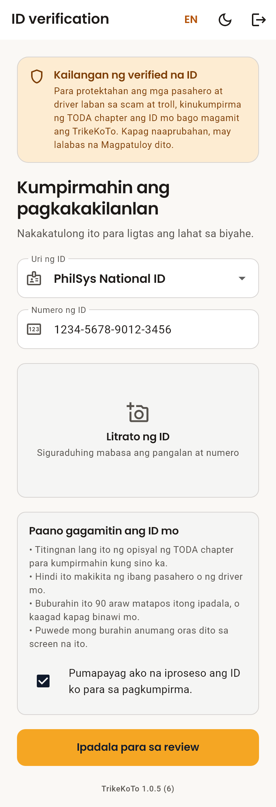
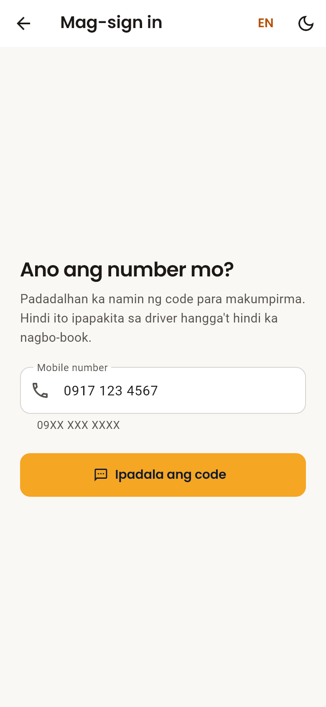
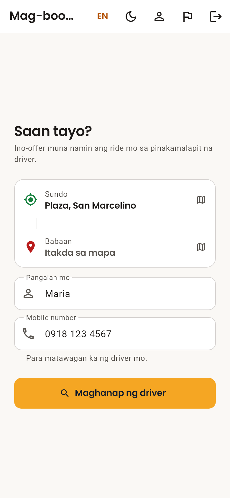
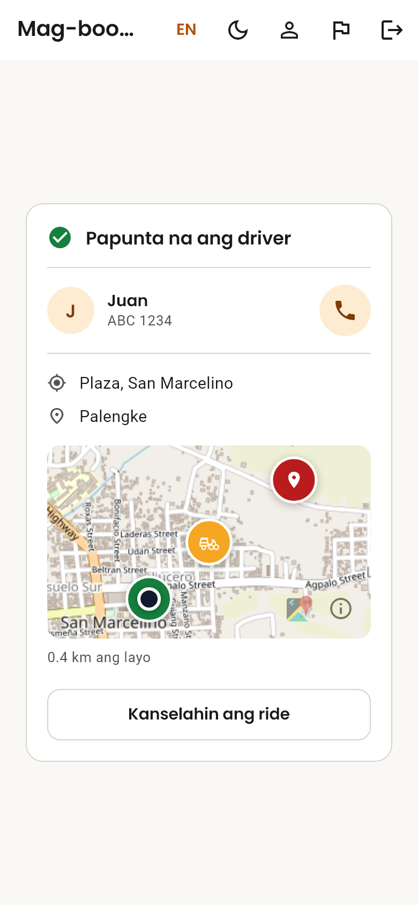
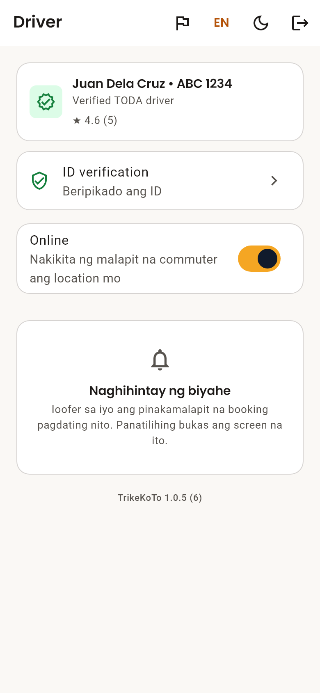
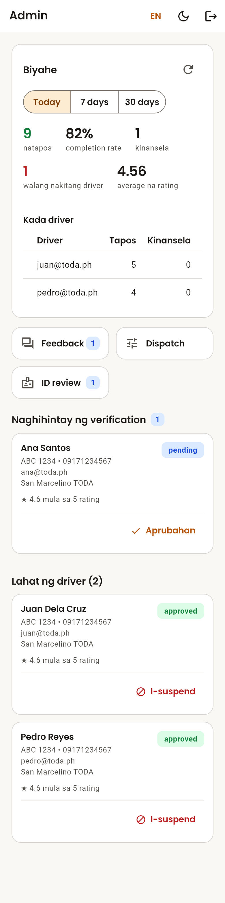
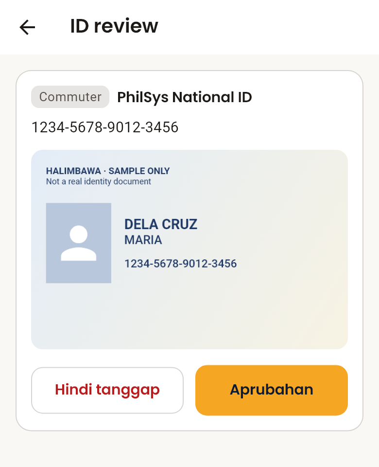

# TrikeKoTo — End-User Manual

*Version 1.0.5 (6) · September 2026*

> Generated by `scripts/build_user_manual.cjs`. Edit the script and rebuild; do not edit this file by hand.

## 1. Introduction

TrikeKoTo is a tricycle ride-hailing system for Tricycle Operators and Drivers’ Associations (TODA). A commuter books a tricycle from a phone, the system offers the ride to the nearest available driver, and both follow the trip on a live map until the passenger is dropped off.

This manual explains how to install and use the system. It has one part for each kind of user:

- **Commuters** — passengers who book rides (Section 4).
- **Drivers** — TODA members who accept and complete rides (Section 5).
- **Administrators** — TODA officers who approve drivers and IDs and run the service (Section 6).

### How to read this manual

The app opens in Filipino. Buttons and labels are written the way they appear on screen, with the English wording in brackets — for example **Mag-book ng ride** (Book a ride). If you switch the app to English, look for the wording in brackets.

> **Note:** This manual describes version 1.0.5 (6). The version is printed at the bottom of the landing screen, the driver screen, the commuter Profile screen and the ID verification screen.

## 2. Before You Start

### 2.1 What you need

|  | Requirement |
|---|---|
| Android phone | Android 7.0 or newer, with GPS and an internet connection (mobile data or Wi-Fi). |
| iPhone, tablet or computer | A current web browser. Use the web version at **trikekoto.web.app**. |
| Commuters | A Philippine mobile number that can receive SMS, and a government-issued ID. |
| Drivers | An email address, a registered tricycle and plate number, TODA membership, and a government-issued ID. |
| Administrators | An administrator account set up by the project team (see Section 6.1). |

### 2.2 Installing the app on Android

1. On the phone, open the download link **trikekoto.web.app/download/trikekoto.apk**, or scan the QR code given by your TODA.
2. When the download finishes, tap the file to open it.
3. If Android asks, allow your browser or file manager to **install unknown apps**, then go back and tap **Install**.
4. Open **TrikeKoTo** from your home screen.

> **Note:** Download the app over a connection you trust, such as your mobile data. To update, install the new file over the existing app — you stay signed in and keep your data. Uninstalling first signs you out.

### 2.3 Using the web version

On an iPhone or a computer, open **trikekoto.web.app** in a browser. The web version has the same screens. When the browser asks to use your location, choose **Allow**.

### 2.4 Controls at the top of the screen

Most screens have some or all of these controls in the bar at the top:

| Control | What it does |
|---|---|
| **EN** or **FIL** | Switches the whole app between Filipino and English. The label shows the language you will switch **to**. Your choice is remembered. |
| Moon or sun icon | Switches between light and dark colours. Your choice is remembered. |
| Flag icon | Reports a problem or suggestion to the TODA administrator (Section 4.9). Found on the booking and driver screens. |
| Exit icon | Signs you out of the app. |

### 2.5 Signing in and staying signed in

After the first sign-in, TrikeKoTo keeps you signed in on that phone. Commuters are asked for an SMS code again only when they:

- sign out,
- uninstall and reinstall the app, or
- sign in on a different phone.

Your ID verification belongs to your account, so it carries over to a new phone. You never need to verify your ID again (Section 7.2).

## 3. Identity Verification

To protect passengers and drivers from scams and trolls, **every account must have a government ID approved by the TODA chapter before it can be used**. Commuters cannot book, and drivers cannot go online or accept rides, until their ID is approved.

### 3.1 Accepted IDs

PhilSys National ID, Driver’s License (LTO), UMID, PhilHealth ID, Postal ID, Voter’s ID, Passport, Senior Citizen ID, Student ID, and Barangay ID.

### 3.2 Submitting your ID

The **ID verification** (ID verification) screen appears on its own after you sign up.

*Figure 1. The ID verification screen*

1. Choose your ID from **Uri ng ID** (ID type).
2. Type the number printed on the card in **Numero ng ID** (ID number).
3. Tap the photo area and choose **Kunan ng litrato ang ID** (Photograph the ID) or **Pumili sa gallery** (Choose from gallery). Make sure the name and number can be read.
4. Read **Paano gagamitin ang ID mo** (How your ID is used), then tick **Pumapayag ako na iproseso ang ID ko para sa pagkumpirma** (I agree to my ID being processed for verification).
5. Tap **Ipadala para sa review** (Send for review).

The screen changes to **Hinihintay ang review** (Waiting for review). You do not need to keep it open.

### 3.3 After review

| You see | What it means | What to do |
|---|---|---|
| **Beripikado na** (Verified) | The chapter approved your ID. | Tap **Magpatuloy** (Continue) to start using the app. |
| **Hindi tinanggap** (Not accepted) | The chapter could not accept it. The reason is shown below the title. | Tap **Bawiin at burahin ang ID** (Withdraw and delete the ID), then send a clearer photo or a different ID. |
| **Hinihintay ang review** (Waiting for review) | An officer has not looked at it yet. | Wait. Approval is done by a person, so it may take some time. |

> **Note:** Only one ID is ever needed per account. Once approved, the app shows **Beripikado ang ID** (ID verified) and will not ask again, even after the photo is deleted.

## 4. Commuter Guide

### 4.1 Creating your account

1. Open the app and tap **Mag-book ng ride** (Book a ride).
2. Under **Ano ang number mo?** (What is your number?), type your mobile number (09XX XXX XXXX) and tap **Ipadala ang code** (Send code).
3. Type the six-digit code from the SMS and tap **Kumpirmahin** (Confirm). To use a different number, tap **Ibang number** (Use a different number).
4. On **Konti na lang** (Almost done), add a photo if you like (you can skip it) and type the name the driver should call you.
5. Tap **Simulan** (Start).
6. Submit your ID and wait for approval (Section 3).

*Figure 2. Signing in with a mobile number*

> **Note:** Your number is not shown to any driver until you book a ride.

### 4.2 Booking a ride

*Figure 3. The booking screen*

1. On **Saan tayo?** (Where to?), check **Sundo** (Pickup). The app fills it in with your current location. To change it, tap it and set it on the map (Section 4.3).
2. Tap **Babaan** (Drop-off) and set where you are going.
3. Check the trip line, which shows the distance and about how many minutes the trip takes.
4. Check your name and mobile number, so the driver can find and call you.
5. Tap **Maghanap ng driver** (Find a driver).

> **Note:** The app does not show or charge a fare. Pay the posted TODA fare to the driver in cash.

### 4.3 Setting a place on the map

There are three ways to place the pin:

- Type a place in **Maghanap ng lugar** (Search a place) and tap **Hanapin** (Search).
- Drag the map, or tap a spot on it, to move the pin.
- Tap **Nasa akin ngayon** (Where I am now) to use your current location.

Then type a name for the place in **Pangalanan ang lugar** (Name this place) — for example Plaza, Palengke or Barangay Hall — and tap **Kumpirmahin ang location** (Confirm location). The driver sees this name.

### 4.4 Waiting for a driver

The screen shows **Naghahanap ng driver…** (Looking for a driver…). The system offers your ride to the nearest available driver first. If that driver does not answer within 15 seconds, it asks the next nearest, and so on. The line **Natanong na ang 3 sa 10 malapit na driver** (Asked 3 of 10 nearby drivers) shows how many have been asked.

- The search continues even if you close the app.
- If no driver accepts after 10 drivers or about 5 minutes, the search stops and the booking screen appears again. Try again later.

### 4.5 When a driver accepts

*Figure 4. Tracking an accepted ride*

The screen changes to **Papunta na ang driver** (Driver is on the way) and shows the driver’s name and tricycle plate number. The map shows where the driver is and how far away.

- To call the driver, tap the phone button, **Tawagan si …** (Call …).
- When the trip starts, the screen changes to **Papunta na sa babaan mo** (On the way to your drop-off).

### 4.6 Cancelling a ride

Tap **Kanselahin ang ride** (Cancel ride). You can cancel while searching and after a driver accepts, but **not after the trip has started**.

### 4.7 Rating your driver

After you are dropped off, the app asks **Kumusta ang biyahe mo?** (How was your ride?). Tap 1 to 5 stars. Each ride can be rated **once**, and the rating cannot be changed.

### 4.8 Your profile

Tap your photo at the top of the booking screen (a person icon if you have not added one) to open **Profile**.

- **Photo** — tap it to take a new one, choose from the gallery, or **Alisin ang litrato** (Remove photo). Tap **I-save** (Save) to keep the change.
- **Name** — edit it and tap **I-save** (Save).
- **Mobile number** — shown as confirmed. It cannot be edited. Signing in with a different number creates a separate account, which needs its own ID verification.
- **ID** — shows **Beripikado ang ID** (ID verified) once approved. Tap it to see your ID or delete the photo.

#### Deleting your account

1. At the bottom of Profile, tap **Burahin ang account** (Delete account).
2. Read what will be deleted and what will be kept, then confirm.

Your name, photo, ID and account are deleted permanently. Past rides stay as a TODA record, but your name and number are removed from them. If the app asks you to sign in again first, do so — this is a security check.

### 4.9 Reporting a problem

1. Tap the flag icon at the top of the screen.
2. Choose **Problema** (Problem), **Mungkahi** (Suggestion), **Tanong** (Question) or **Iba pa** (Other).
3. Describe what happened in **Ano ang nangyari?** (What happened?).
4. Add a contact in **Contact (opsyonal)** (Contact (optional)) only if you want a reply.
5. Tap **Ipadala ang report** (Send report).

## 5. Driver Guide

### 5.1 Registering

1. Open the app and tap **Mag-sign in bilang driver o admin** (Driver / Admin sign in).
2. Tap **Magparehistro bilang TODA driver** (Register as a TODA driver).
3. Fill in the form (see the table below).
4. Tap **Gumawa ng account** (Create account).
5. Submit your ID (Section 3).

| Field | What to enter |
|---|---|
| **Pangalan** (First name) / **Apelyido** (Last name) | Your name, as printed on your license. |
| **Mobile number** | The number commuters will call when you accept their ride. |
| **Plate number** | Your tricycle’s plate. Commuters use it to find you. |
| **TODA chapter** | The chapter you belong to. |
| **Email** and **Password** | What you will use to sign in. The password needs at least 6 characters. |

### 5.2 Waiting for approval

Two approvals are needed before you can take rides: your **ID** (Section 3) and your **driver registration**. The banner at the top of the driver screen shows your registration status and updates on its own.

| Banner | Meaning |
|---|---|
| **Hinihintay ang verification** (Pending verification) | An administrator has not approved you yet. Tell your TODA officer you have registered. |
| **Verified TODA driver** | You are approved and can go online. |
| **Naka-suspend ang account mo** (Your account is suspended) | You cannot accept rides. Talk to your TODA officer. |
| **Hindi natanggap ang registration mo** (Your registration was rejected) | Talk to your TODA officer. |

### 5.3 Going online

*Figure 5. The driver screen with the Online switch*

1. Turn on **Location** on your phone.
2. Slide the **Offline** switch to **Online**.
3. If asked, allow location access **while using the app**, and allow notifications.
4. Wait while the switch shows **Kumokonekta…** (Connecting…). Do not tap it again.

When the switch shows **Online**, you appear to nearby commuters and the screen says **Naghihintay ng biyahe** (Waiting for a ride).

If going online fails, a red message explains why (see Section 8). If a line starting with **Detalye para sa suporta** (Details for support) appears under the switch, take a screenshot and send it to your TODA officer.

### 5.4 Accepting a ride

When a commuter nearby books, your phone shows a notification and the screen shows **Bagong ride offer** (New ride offer) with the pickup and drop-off.

- **Tanggapin** (Accept) — the ride is yours.
- **Tanggihan** (Decline) — the ride goes to the next nearest driver.

Each offer lasts about 15 seconds. If you do not answer in time, the ride goes to another driver. If two drivers accept at the same moment, only one gets the ride, and the app tells the other.

### 5.5 During the ride

The **Kasalukuyang biyahe** (Current ride) card shows a map to **Sunduin sa …** (Pick up at …) and then **Ibaba sa …** (Drop off at …).

- **Buksan sa maps** (Open in maps) opens directions in your maps app.
- The phone button calls the commuter if you cannot find them.

1. When the passenger is on board, tap **Simulan ang biyahe** (Start trip).
2. When they have been dropped off, tap **Tapusin ang biyahe** (Complete ride).
3. Collect the posted TODA fare in cash.

To call off a ride, tap **Kanselahin** (Cancel).

### 5.6 Going offline

Slide the switch back to **Offline**. You stop receiving offers and the app stops using your location. Go offline when you finish your shift — staying online uses battery and data.

## 6. Administrator Guide

### 6.1 Getting access

Administrator accounts cannot be created from inside the app. The project team adds your email address to the list of administrators. You then:

1. Open the app and tap **Mag-sign in bilang driver o admin** (Driver / Admin sign in), then sign in with your email and password.
2. If you see **Kumpirmahin ang email mo** (Confirm your email), tap **Ipadala ang verification email** (Send verification email), open the link in your email (check spam), come back and tap **Nakumpirma ko na** (I have confirmed it).

You only confirm your email once. If you are taken to the driver screen instead, your administrator entry does not match your email address; contact the project team.

### 6.2 The dashboard

The administrator dashboard has shortcuts to **Feedback**, **Dispatch** and **ID review**, a ride summary, and the list of drivers.

*Figure 6. The administrator dashboard*

#### Ride summary

Choose **Today**, **7 days** or **30 days**, then tap **I-refresh** (Refresh). The summary does not update live while you watch it; tap it again to load the latest rides.

| Figure | Meaning |
|---|---|
| **natapos** (completed) | Rides that finished. |
| **completion rate** | Completed rides out of all rides that ended. Rides still in progress are not counted. |
| **kinansela** (cancelled) | Rides called off by the commuter or the driver. |
| **walang nakitang driver** (no driver found) | Rides no driver accepted. A high number means too few drivers online or a search radius that is too small. |
| **average na rating** (avg rating) | The average star rating of rated rides. |

Below the figures are a daily chart and a **Kada driver** (By driver) table.

### 6.3 Approving drivers

New registrations appear under **Naghihintay ng verification** (Pending verification) with their name, plate, mobile number, email and TODA chapter.

1. Check the details against your chapter records. The app only records what the driver typed.
2. Tap **Aprubahan** (Approve). The driver’s app updates within seconds.

To stop a driver from accepting rides, tap **I-suspend** (Suspend) on their entry in **Lahat ng driver** (All drivers). To reinstate them, tap **Aprubahan** (Approve).

### 6.4 Reviewing IDs

*Figure 7. Reviewing a submitted ID*

1. Open **ID review** (ID review). Each card shows whether the person is a driver or commuter, the ID type and number.
2. Tap **Tingnan ang ID** (View the ID) and check the photo.
3. If the ID is valid and matches, tap **Aprubahan** (Approve).
4. If not, tap **Hindi tanggap** (Not accepted), type the reason (for example, a blurry photo), and tap **Ipadala** (Send). The person sees your reason.

> **Note:** **Aprubahan** (Approve) stays disabled until you have opened the photo — an ID has to be seen before it can be approved. ID photos are never saved on your phone.

### 6.5 Handling feedback

Reports from drivers and commuters are listed under **Kailangan ng atensyon** (Needs attention). After acting on one, tap **Markahang naresolba** (Mark resolved). If the problem returns, tap **Buksan ulit** (Reopen) under **Naresolba** (Resolved).

### 6.6 Dispatch settings

Changes here reach every phone within seconds, without an app update.

| Setting | Default | Allowed | What it does |
|---|---|---|---|
| **Search radius (km)** | 5 | 0.5–50 | Drivers farther than this are never offered the ride. |
| **Offer timeout (seconds)** | 15 | 5–120 | How long one driver has to answer before the next is asked. |
| **Bilang ng driver na susubukan** (Drivers to try) | 10 | 1–10 | How many drivers are asked before the search stops. |

Tap **I-save ang settings** (Save settings) after editing.

#### Stopping bookings

To halt the service, turn off **Tumatanggap ng booking** (Accepting bookings) and confirm with **Ihinto ang booking** (Stop bookings). Commuters cannot book until you turn it back on. **Rides already in progress finish normally.**

## 7. Your Data and Privacy

### 7.1 Your government ID

- Only TODA chapter officers can see your ID, to confirm who you are. Other passengers and drivers cannot.
- The ID photo and details are deleted automatically **90 days** after you submit them, or immediately when you withdraw them.
- You can delete your ID at any time from the ID verification screen with **Bawiin at burahin ang ID** (Withdraw and delete the ID).

### 7.2 Verification stays with your account

Deleting the ID photo does not undo your verification. Only the fact that you were verified is kept, with no ID details. It is removed when you delete your account.

### 7.3 What others see

| Who | Sees |
|---|---|
| A driver offered or assigned your ride | Your name, photo (if you added one), mobile number, pickup and drop-off. |
| A commuter on your ride | The driver’s first name, plate number and live location. |
| TODA administrators | Driver details, ride records, feedback, and submitted IDs for review. |

## 8. Troubleshooting

Messages are listed in Filipino, with the English wording in brackets.

### 8.1 Signing in

| Message | What to do |
|---|---|
| **Mali ang code. Tingnan ulit ang message.** (Wrong code. Check the message again.) | Type the six digits from the latest SMS. |
| **Nag-expire na ang code. Humingi ng bago.** (That code expired. Ask for a new one.) | Go back and tap **Ipadala ang code** (Send code) again. |
| **Masyadong maraming subok…** (Too many tries…) | Wait a few minutes before trying again. |
| **Walang connection. Tingnan ang signal mo.** (No connection. Check your signal.) | Move to a place with signal, or switch between mobile data and Wi-Fi. |
| **Mukhang hindi ito mobile number.** (That does not look like a mobile number.) | Enter an 11-digit number starting with 09. |

### 8.2 ID verification

| Message | What to do |
|---|---|
| **Kailangan ng litrato ng ID.** (A photo of the ID is required.) | Add a photo of the card before sending. |
| **Kailangan mong pumayag muna.** (You need to agree first.) | Tick the agreement box. |
| **Hindi tinanggap ng server ang litrato…** (The server refused the photo…) | Your ID may already be approved. Go back; if the app still asks for an ID, contact your TODA officer. |

### 8.3 Booking

| Problem or message | What to do |
|---|---|
| No driver accepts and the booking screen comes back | No driver was available nearby. Try again in a few minutes. |
| **Walang nakitang … malapit dito** (Nothing called … found near here) | Drag the map to the area first, or place the pin by hand. |
| **Tinatantiya — hindi maabot ang route service** (Approximate — could not reach the route service) | The distance is an estimate. You can still book. |
| **Hindi mabuksan ang dialler…** (Could not open the dialler…) | Dial the number shown in the message by hand. |

### 8.4 Going online (drivers)

| Message | What to do |
|---|---|
| **Naka-off ang location ng phone…** (Your phone’s location is off…) | Turn on Location in the phone’s quick settings. |
| **Kailangan ng location permission para mag-online.** (Location permission is needed to go online.) | Try again and allow location access. |
| **Naka-block ang location permission…** (Location permission is blocked…) | Open the phone’s Settings > Apps > TrikeKoTo > Permissions > Location, and allow it. |
| **Hindi makakuha ng location…** (Cannot get a location fix…) | Move outdoors or near a window, then try again. |
| **Hindi pinayagan ng server na mag-online…** (The server refused to put you online…) | Check that your ID and registration are approved. If they are, send a screenshot to your TODA officer. |
| **Hindi naisave sa server ang location mo…** (Your location could not be saved…) | Check your internet connection, then try again. |
| No offers arrive while Online | Check that notifications are allowed for TrikeKoTo, and that a commuter is within the search radius. |

### 8.5 Getting help

Use the flag icon (Section 4.9) to send a report to your TODA administrator. Include what you were doing, and the message on screen if there was one. If the app closes unexpectedly, the error is recorded automatically for the project team.

